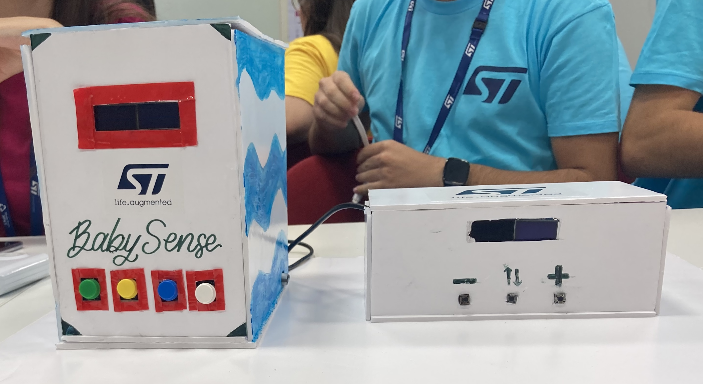
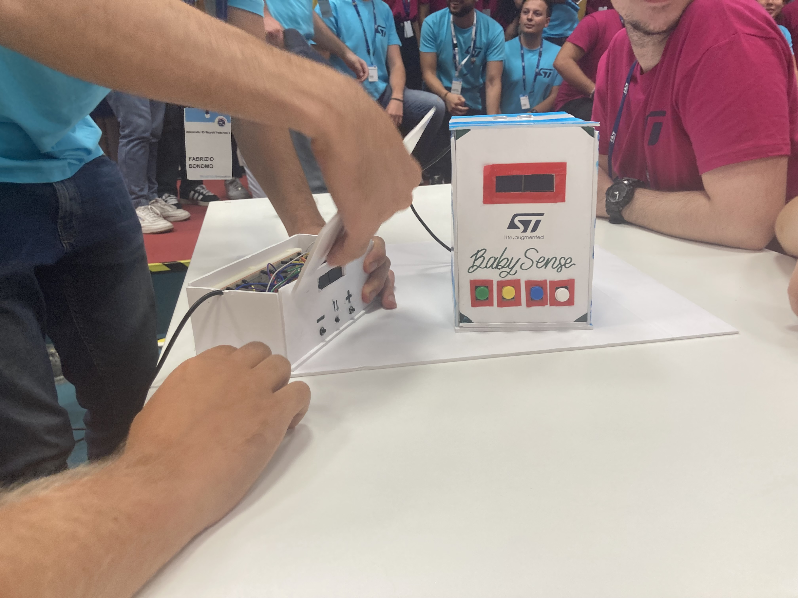
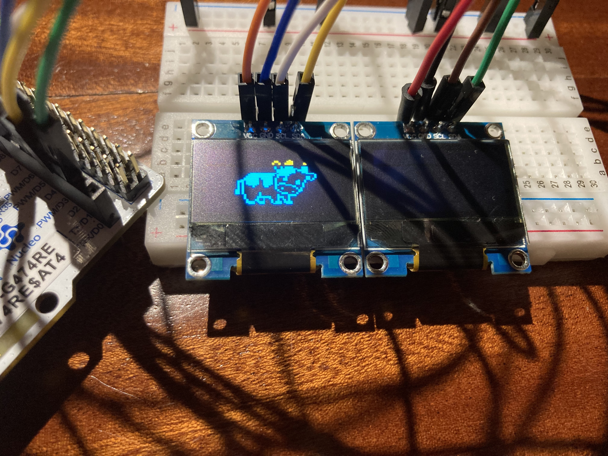
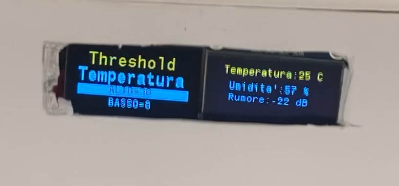
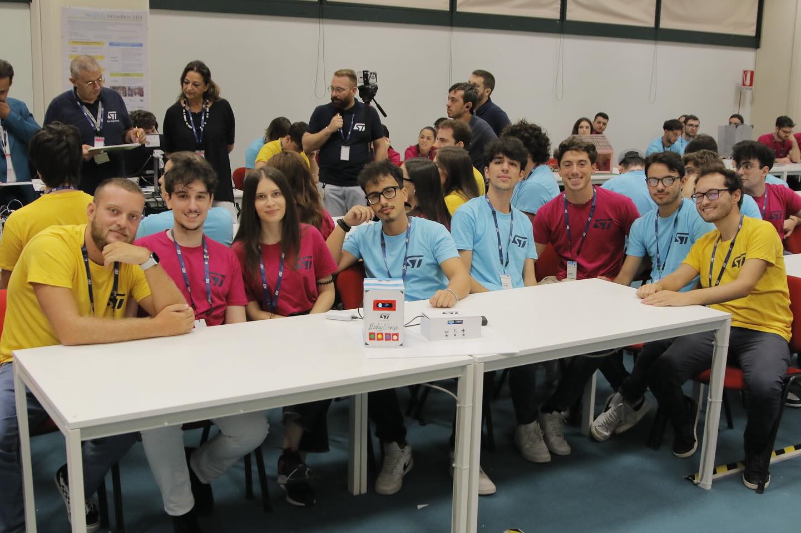

# BabySense

**BabySense** is an embedded prototype baby monitor designed to assist both parents and babies. It was created during the **Neapolis Innovation Summer Campus 2024 (NISC)**, a week-long hackathon hosted at **STMicroelectronics Naples**. The project is just a functional prototype, developed in 5 days.

> 📁 Original codebase was hosted on a TortoiseSVN instance provided by STMicroelectronics. 

## 👶 Concept

BabySense consists of two parts:

- **Baby Unit**: Engages the child through mini-games (Rock Paper Scissors, Animal and Shape Recognition), responds to touch to simulate basic emotional feedback and collects data for the baby's safety.
- **Parent Unit**: Displays the environmental data collected from the Baby Unit(e.g. temperature, noise), and triggers an alarm if a customizable noise decibel is exceeded.

🎥 [Watch a short demo on YouTube](https://youtu.be/uJ5wRD_ZAyA)

## 📸 Photos

<table>

<tr>
<td></td>
<td></td>
</tr>

<tr>
<td>BabySense Units</td>
<td></td>
</tr>

<td></td>
<td></td>

<tr>
<td>Display testing</td>
<td>Close up on parent unit</td>
</tr>

</table>

## 🔧 Technologies & Hardware

The project was created in about a week using a **STM NucleoG4 board**. We used the **ChibiStudio** toolchain that included an IDE and ChibiOS, a free embedded real time operating system.

We employed many sensors provided by the hackathon:

| Component | Purpose |
|----------|---------|
| **IR Sensor** | Communication between baby and parent units |
| **Temperature & Humidity Sensor** | Environmental monitoring |
| **Proximity Sensor** | Petting detection on baby unit |
| **Microphone** | Sound input for alarm threshold |
| **Buttons** | Input for interaction and configuration |
| **Four 48x84 LCDs** | UI display on both devices |
| **Speaker** | Alarm sound feedback |

The outer casing was made with recycled materials (cardboard, tape, markers), with a playful design on the baby unit and a minimal interface for the parent side.

## 👥 Team

Developed by an interdisciplinary team of students during NISC 2024:

| Name | Course | University |
|------|--------| ---- |
| Luigi Inquieto | Computer Engineering | University of Naples "Federico II" |
| Fabrizio Bonomo | Computer Engineering | University of Naples "Federico II" |
| Lorenzo Cavaliere | Computer Engineering | University of Naples "Federico II" |
| Teresa Di Dona | Computer Engineering | University of Naples "Federico II" |
| Manuel Loffredo | Computer Engineering | University of Naples "Federico II" |
| Carmine Sorrentino | Computer Engineering | University of Naples "Federico II" |
| Simone Boscaglia | Computer Science | University of Naples "Parthenope" |
| Luca Criscuolo | Cybersecurity | University of Naples "Parthenope" |

<td></td>
